# Apress Source Code

This repository accompanies [*Geometric Patterns with Creative Coding: Playing with Creative Coding*](https://www.link.springer.com/book/10.1007/9781484293881) by Selçuk Artut (Apress, 2023).

[comment]: #cover

Download the files as a zip using the green button, or clone the repository to your machine using Git.

## Releases

Release v1.0 corresponds to the code in the published book, without corrections or updates.

## Contributions

See the file Contributing.md for more information on how you can contribute to this repository.

## Workflows for the Patterns

<h3 align="left">Workflow 1:</h3>

    

<h3 align="left">Workflow 2:</h3>

    

<h3 align="left">Workflow 3:</h3>

 <a href="https://github.com/Apress/Geometric-Patterns-with-Creative-Coding/blob/main/codes/WF3/Motif%20code/sketch.js" target="_blank" rel="noreferrer"> 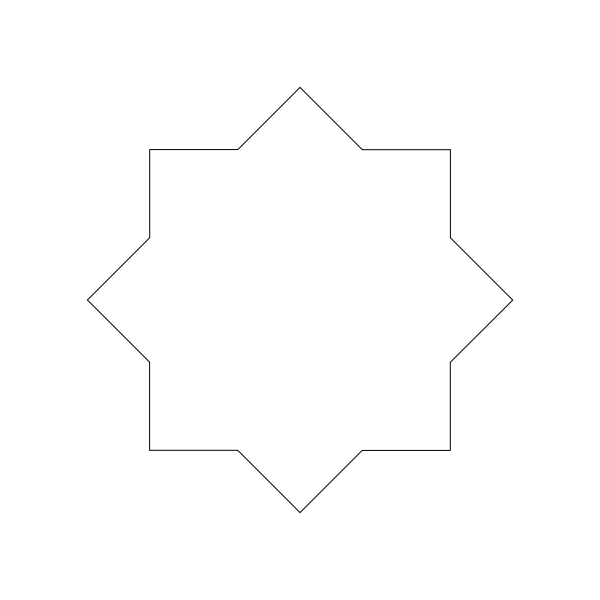 </a> <a href="https://github.com/Apress/Geometric-Patterns-with-Creative-Coding/blob/main/codes/WF3/Tesselation%20code/sketch.js" target="_blank" rel="noreferrer"> 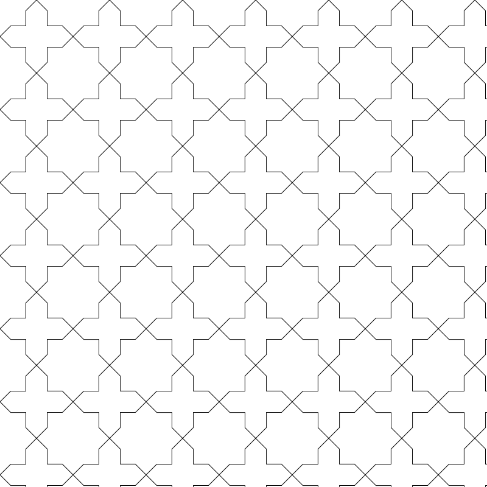 </a>  

<h3 align="left">Workflow 4:</h3>

    

<h3 align="left">Workflow 5:</h3>

 <a href="https://github.com/Apress/Geometric-Patterns-with-Creative-Coding/blob/main/codes/WF5/Motif%20code/sketch.js" target="_blank" rel="noreferrer"> 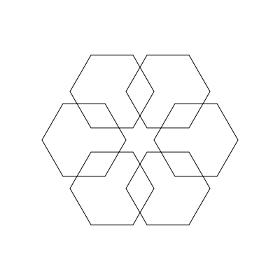 </a> <a href="https://github.com/Apress/Geometric-Patterns-with-Creative-Coding/blob/main/codes/WF5/Tesselation%20code/sketch.js" target="_blank" rel="noreferrer"> 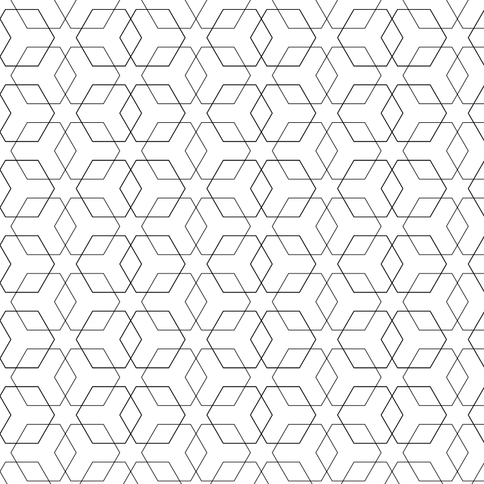 </a>  

<h3 align="left">Workflow 6:</h3>

    

<h3 align="left">Workflow 7:</h3>

  <a href="https://github.com/Apress/Geometric-Patterns-with-Creative-Coding/blob/main/codes/WF7/Tesselation%20code/sketch.js" target="_blank" rel="noreferrer"> 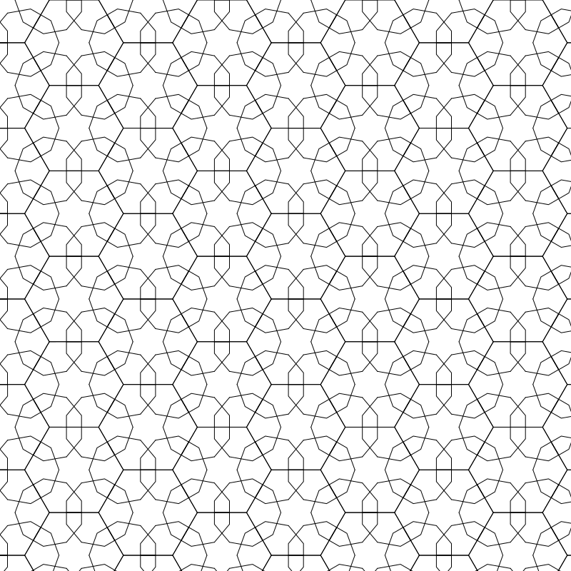 </a>  

<h3 align="left">Workflow 8:</h3>

 <a href="https://github.com/Apress/Geometric-Patterns-with-Creative-Coding/blob/main/codes/WF8/Motif%20code/sketch.js" target="_blank" rel="noreferrer"> 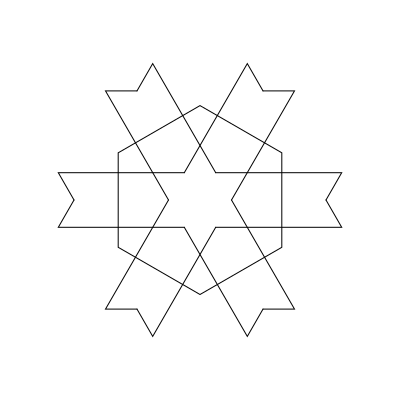 </a>   

<h3 align="left">Workflow 9:</h3>

  <a href="https://github.com/Apress/Geometric-Patterns-with-Creative-Coding/blob/main/codes/WF9/Tesselation%20code/sketch.js" target="_blank" rel="noreferrer"> 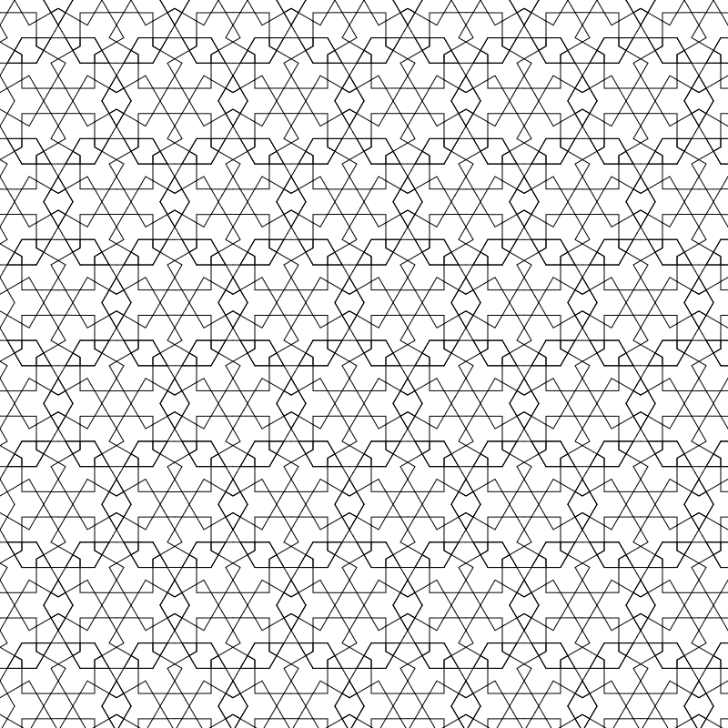 </a>  

<h3 align="left">Workflow 10:</h3>

 <a href="https://github.com/Apress/Geometric-Patterns-with-Creative-Coding/blob/main/codes/WF10/Motif%20code/sketch.js" target="_blank" rel="noreferrer"> 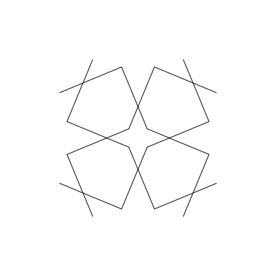 </a>   

<h3 align="left">Workflow 11:</h3>

    

<h3 align="left">Workflow 12:</h3>

    

<h3 align="left">Workflow 13:</h3>

    

<h3 align="left">Workflow 14:</h3>

 <a href="https://github.com/Apress/Geometric-Patterns-with-Creative-Coding/blob/main/codes/WF14/Motif%20code/sketch.js" target="_blank" rel="noreferrer"> 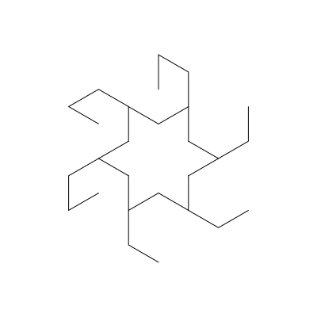 </a>   

<h3 align="left">Workflow 15:</h3>

 <a href="https://github.com/Apress/Geometric-Patterns-with-Creative-Coding/blob/main/codes/WF15/Motif%20code/sketch.js" target="_blank" rel="noreferrer"> 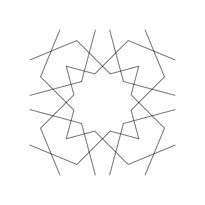 </a> <a href="https://github.com/Apress/Geometric-Patterns-with-Creative-Coding/blob/main/codes/WF15/Tesselation%20code/sketch.js" target="_blank" rel="noreferrer"> 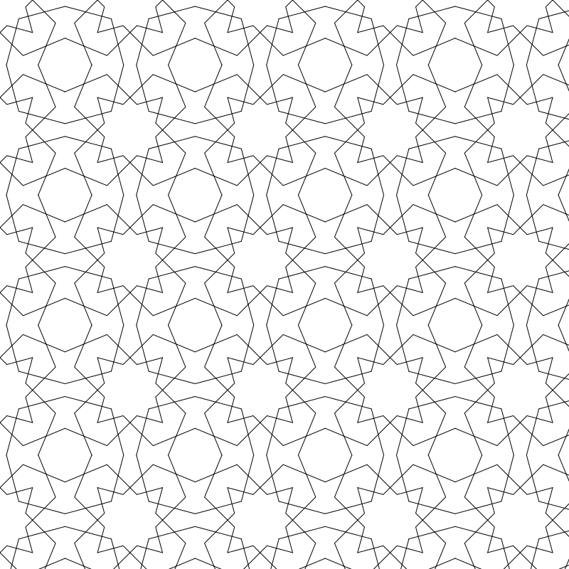 </a>  

<h3 align="left">Workflow 16:</h3>

    

<h3 align="left">Workflow 17:</h3>

    

<h3 align="left">Workflow 18:</h3>

    

<h3 align="left">Workflow 19:</h3>

    

<h3 align="left">Workflow 20:</h3>

    

<h3 align="left">Workflow 21:</h3>

 <a href="https://github.com/Apress/Geometric-Patterns-with-Creative-Coding/blob/main/codes/WF21/Motif%20code/sketch.js" target="_blank" rel="noreferrer"> 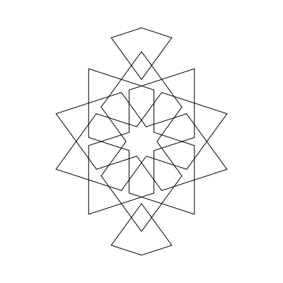 </a>   
